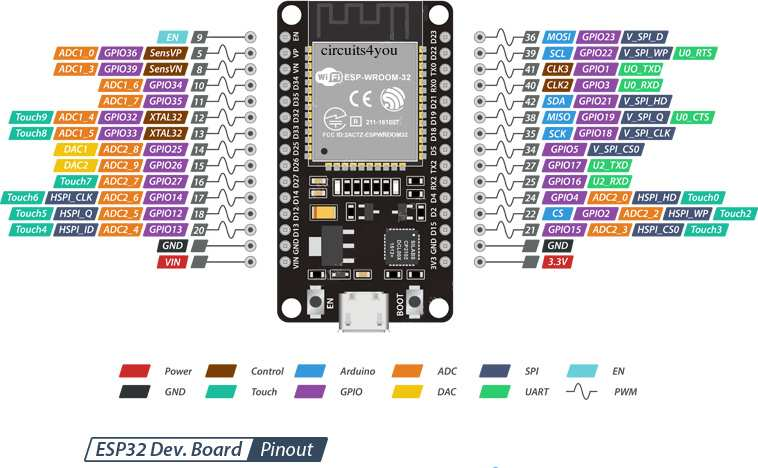

# Proyectos ESP32 con Arduino IDE


Repositorio personal de proyectos y pruebas con placas basadas en ESP32 usando Arduino IDE 2.

El objetivo es reunir ejercicios, experimentos, módulos reutilizables y proyectos completos relacionados con conectividad Wi-Fi, sensores, pantallas, almacenamiento, baterías y dispositivos interactivos.

## Contenido del repositorio (en construcción)

```text
esp32-arduino-proyectos/
├── README.md
├── LICENSE
├── docs/
│   ├── instalacion-arduino-ide.md
│   ├── librerias.md
│   ├── notas-tecnicas.md
│   └── placas.md
├── projects/
│   └── 001-wifi-scan/
│       ├── README.md
│       └── wifi_scan/
│           └── wifi_scan.ino
└── assets/
    └── README.md
```

## Proyectos

| Nº | Proyecto | Descripción | Estado |
| --: | --- | --- | --- |
| 001 | [WiFi Scan](projects/DOIT_ESP32_DEVKIT_V1_05_ESCANNER_WIFI_1) | Escaneo de redes Wi-Fi cercanas desde una placa ESP32 DEVKIT V1 / ESP-WROOM-32, con salida tabulada en el Serial Monitor. | Funcional |
| 002 | [WiFi Connect](projects/DOIT_ESP32_DEVKIT_V1_06_WIFI_CONNECT) | Conexión a una red Wi-Fi conocida y visualización del estado de red en el Serial Monitor. | Funcional |
| 003 | [Reloj de Red](projects/DOIT_ESP32_DEVKIT_V1_07_NTP_CLOCK) | Conexión Wi-Fi, diagnóstico DNS y sincronización de fecha y hora mediante NTP desde una placa ESP32 DEVKIT V1 / ESP-WROOM-32. | Funcional |
| 004 | [Servidor Web Local](projects/DOIT_ESP32_DEVKIT_V1_10_WEB_STATUS) | Crea una red Wi-Fi en modo Access Point, permite acceder a una página de estado desde el navegador e intenta sincronizar fecha y hora mediante NTP desde una placa ESP32 DEVKIT V1 / ESP-WROOM-32. | Funcional |

## Placas utilizadas

Por ahora el repositorio incluye pruebas realizadas con:

- ESP32 DEVKIT V1 / ESP-WROOM-32

<p align="center"></p>


Más adelante se pueden agregar proyectos para otras placas ESP32, ESP32-S3, pantallas táctiles, sensores externos y módulos de alimentación.

## Entorno de desarrollo

Los proyectos están pensados para:

- Arduino IDE 2
- Core `esp32 by Espressif Systems`
- Monitor serie a `115200 baud`, salvo que el proyecto indique otra configuración

La configuración general de Arduino IDE está documentada en [`docs/instalacion-arduino-ide.md`](docs/instalacion-arduino-ide.md).

## Organización del código

Cada proyecto de `projects/` tiene su propio `README.md`.

En los proyectos Arduino, la carpeta del sketch y el archivo `.ino` tienen el mismo nombre. Por ejemplo:

```text
wifi_scan/
└── wifi_scan.ino
```

Esto permite abrir el proyecto directamente desde Arduino IDE usando:

```text
File → Open...
```

## Próximos proyectos

- Portal de configuración Wi-Fi desde el ESP32.
- Lectura de sensores ambientales.
- Estación meteorológica con datos locales y datos web.
- Uso de pantalla táctil en ESP32-S3.
- Rotación de pantalla usando IMU.

## Licencia

Este repositorio se publica con fines educativos y personales bajo licencia MIT. Ver [`LICENSE`](LICENSE).
