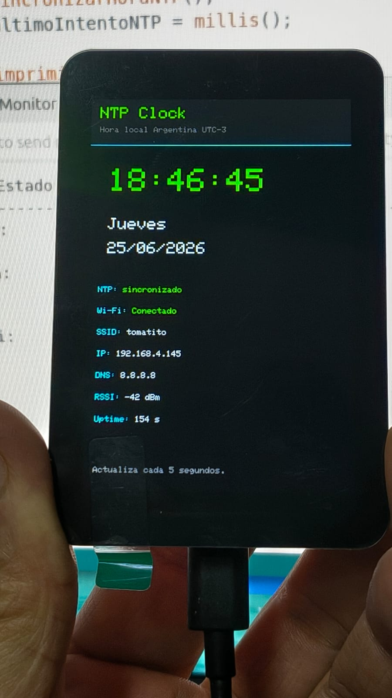

# 006 - ESP32-S3 Touch LCD 3.5B - NTP Clock


Adaptacion del [proyecto NTP Clock para la placa Waveshare ESP32-S3 Touch LCD 3.5B](https://github.com/VintaBytes/esp32-arduino-proyectos/blob/main/projects/DOIT_ESP32_DEVKIT_V1_07_NTP_CLOCK).

El proyecto conecta la placa a una red Wi-Fi conocida, verifica resolucion DNS, sincroniza fecha y hora mediante NTP y muestra el reloj tanto en el Serial Monitor como en la pantalla incorporada.

En esta version, la conexion Wi-Fi, la configuracion DNS y la sincronizacion NTP se realizan antes de inicializar la pantalla. Este orden resulto necesario en las pruebas con la placa real para evitar fallos de resolucion DNS durante el arranque.

<p align="center"></p>

## Objetivo

Verificar que la placa ESP32-S3 Touch LCD 3.5B pueda conectarse a internet, obtener fecha y hora reales mediante servidores NTP y mostrar esa informacion en pantalla.

Esta prueba confirma:

* Compilacion correcta del sketch.
* Carga correcta desde Arduino IDE 2.
* Funcionamiento del Serial Monitor.
* Inicializacion de la pantalla incorporada.
* Conexion a una red Wi-Fi conocida.
* Acceso a internet desde la placa.
* Resolucion DNS desde el ESP32-S3.
* Sincronizacion horaria mediante NTP.
* Visualizacion de fecha y hora local Argentina UTC-3.
* Lectura de datos basicos de red.
* Reconexion basica si se pierde la conexion Wi-Fi.

## Placa utilizada

* Placa: Waveshare ESP32-S3 Touch LCD 3.5B
* Modulo: ESP32-S3R8
* Entorno: Arduino IDE 2
* Board usada: `ESP32S3 Dev Module`
* Monitor serie: `115200 baud`

## Componentes necesarios

* Placa Waveshare ESP32-S3 Touch LCD 3.5B.
* Cable USB-C de datos.
* Computadora con Arduino IDE 2.
* Red Wi-Fi disponible de 2.4 GHz.
* Nombre y contraseña de la red Wi-Fi.
* Acceso a internet.

No requiere sensores ni conexiones externas.

## Librerias necesarias

El proyecto usa:

```cpp
#include <WiFi.h>
#include <time.h>
#include <Wire.h>
#include <Arduino_GFX_Library.h>
#include "TCA9554.h"
#include "config_wifi.h"
```

Instalar desde el Library Manager de Arduino IDE:

* `GFX Library for Arduino`
* `TCA9554`

Las librerias `WiFi.h`, `time.h` y `Wire.h` vienen incluidas con el core `esp32 by Espressif Systems` y el entorno Arduino.

## Como abrir el proyecto

Desde Arduino IDE 2:

```text
File -> Open...
```

Abrir el archivo:

```text
projects/ESP32_S3_TOUCH_LCD_35B_07_NTP_CLOCK/ESP32_S3_TOUCH_LCD_35B_07_NTP_CLOCK/ESP32_S3_TOUCH_LCD_35B_07_NTP_CLOCK.ino
```

## Configuracion en Arduino IDE 2

Seleccionar la placa:

```text
Tools -> Board -> esp32 -> ESP32S3 Dev Module
```

Configuracion recomendada:

```text
USB CDC On Boot: Enabled
CPU Frequency: 240MHz (WiFi)
Flash Mode: QIO 80MHz
Flash Size: 16MB (128Mb)
Partition Scheme: 16M Flash (3MB APP/9.9MB FATFS)
PSRAM: OPI PSRAM
Upload Mode: UART0 / Hardware CDC
Upload Speed: 921600
USB Mode: Hardware CDC and JTAG
```

Seleccionar el puerto:

```text
Tools -> Port
```

Abrir el monitor serie:

```text
Tools -> Serial Monitor
```

Configurar:

```text
115200 baud
```

## Configuracion de la red Wi-Fi

El proyecto usa un archivo local:

```text
config_wifi.h
```

Antes de compilar, completar los datos de la red Wi-Fi:

```cpp
#ifndef CONFIG_WIFI_H
#define CONFIG_WIFI_H

const char* WIFI_SSID = "NOMBRE_DE_TU_RED";
const char* WIFI_PASSWORD = "CONTRASENA_DE_TU_RED";

#endif
```

El archivo `config_wifi.h` debe quedar en la misma carpeta que el sketch principal.

## Zona horaria

El proyecto esta configurado para usar la hora local de Argentina:

```cpp
const long GMT_OFFSET_SEC = -3 * 60 * 60;
const int DAYLIGHT_OFFSET_SEC = 0;
```

Esto corresponde a:

```text
Argentina UTC-3
```

Si se quiere usar otra zona horaria, hay que modificar esos valores en el sketch principal.

## Funcionamiento general

El programa realiza estos pasos:

1. Inicia el puerto serie.
2. Configura el ESP32-S3 en modo estacion Wi-Fi.
3. Intenta conectarse a la red configurada.
4. Si el DNS entregado por la red no coincide con el DNS externo esperado, conserva la IP obtenida por DHCP y aplica DNS externos de forma explicita.
5. Si la conexion Wi-Fi es exitosa, muestra IP local, gateway, DNS y señal RSSI.
6. Realiza un diagnostico DNS resolviendo varios servidores NTP.
7. Si la resolucion DNS funciona, inicia la sincronizacion NTP.
8. Consulta servidores de hora en internet.
9. Obtiene fecha y hora local Argentina UTC-3.
10. Inicializa la pantalla incorporada.
11. Muestra un reporte general en el Serial Monitor.
12. Muestra en pantalla un reloj con hora, fecha, dia de semana, estado NTP, Wi-Fi, IP, DNS, RSSI y uptime.
13. Cada 5 segundos actualiza la informacion.
14. Si se pierde la conexion Wi-Fi, intenta reconectar automaticamente.

Durante el arranque, la pantalla puede permanecer apagada hasta que finalizan la conexion Wi-Fi, el diagnostico DNS y la sincronizacion NTP. Esto es intencional: en las pruebas reales, inicializar primero la pantalla podia interferir con la resolucion DNS.

## Datos mostrados en pantalla

El proyecto muestra:

* Hora local.
* Dia de la semana.
* Fecha.
* Estado de sincronizacion NTP.
* Estado de conexion Wi-Fi.
* SSID.
* IP local.
* DNS.
* Intensidad de señal RSSI.
* Tiempo de funcionamiento del programa.

## Ejemplo de salida por Serial Monitor

```text
==============================================
ESP32-S3 TOUCH LCD 3.5B - NTP CLOCK
==============================================

Conectando a Wi-Fi...
SSID: Red_Casa
....
Conexion Wi-Fi establecida correctamente.
IP local: 192.168.4.173
Gateway: 192.168.4.1
DNS 1: 8.8.8.8
DNS 2: 1.1.1.1
RSSI: -41 dBm

Diagnostico DNS:
Resolviendo ar.pool.ntp.org ... OK -> 170.210.222.2
Resolviendo time.google.com ... OK -> 216.239.35.4
Resolviendo time.cloudflare.com ... OK -> 162.159.200.1
Resolviendo time.nist.gov ... OK -> 132.163.97.3

Sincronizando hora mediante NTP...
Servidor 1: ar.pool.ntp.org
Servidor 2: time.google.com
Servidor 3: time.cloudflare.com
Hora sincronizada correctamente.
Fecha y hora actual: 25/06/2026 18:44:28
```

## Archivos principales

| Archivo | Descripcion |
| ------- | ----------- |
| `ESP32_S3_TOUCH_LCD_35B_07_NTP_CLOCK.ino` | Sketch principal del proyecto. |
| `config_wifi.h` | Archivo local con credenciales Wi-Fi. No debe compartirse con datos reales. |

## Estado del proyecto

* [x] Adaptacion inicial preparada
* [x] Compilado en Arduino IDE 2
* [x] Probado en placa real
* [x] Conexion Wi-Fi validada
* [x] DNS externo aplicado correctamente
* [x] Diagnostico DNS validado
* [x] Sincronizacion NTP validada
* [x] Salida por Serial Monitor
* [x] Salida por pantalla incorporada
* [x] Reloj en pantalla validado
* [x] Documentado
* [ ] Reconexion basica validada

## Notas

Este proyecto no usa todavia la pantalla tactil, la IMU, la bateria, la microSD, el RTC PCF85063 ni LVGL.

La primera version usa `Arduino_GFX` para mostrar texto de forma simple en pantalla. LVGL queda reservado para proyectos posteriores con interfaz grafica, botones, menus y pantallas multiples.

La pantalla se inicializa despues de Wi-Fi, DNS y NTP. Aunque durante el arranque pueda verse apagada, este comportamiento es esperado en esta version y mejora la estabilidad de la sincronizacion horaria.

En las pruebas con la red local, la placa recibia inicialmente el DNS del router. Para evitar fallos de resolucion, el sketch conserva la IP obtenida por DHCP y luego aplica DNS externos (`8.8.8.8` y `1.1.1.1`) antes de ejecutar el diagnostico DNS y la sincronizacion NTP.

Si el programa compila pero no conecta a la red Wi-Fi, revisar:

* Que el archivo `config_wifi.h` exista.
* Que `WIFI_SSID` tenga exactamente el nombre de la red.
* Que `WIFI_PASSWORD` tenga la contraseña correcta.
* Que la red sea de 2.4 GHz.
* Que la placa este dentro del alcance del router.
* Que la red tenga acceso a internet.

Si la conexion Wi-Fi funciona pero la hora no se sincroniza, revisar:

* Que el router tenga acceso a internet.
* Que no haya bloqueo de acceso a servidores NTP.
* Que los servidores configurados esten disponibles.
* Que la placa haya obtenido una direccion IP valida.
* Que la resolucion DNS funcione correctamente desde el ESP32-S3.

Si el diagnostico DNS muestra una salida como:

```text
ERROR DNS -> 0.0.0.0
```

significa que la placa esta conectada a la red, pero no pudo resolver correctamente el nombre del servidor. En ese caso, conviene revisar la configuracion DNS, el router o verificar que el sketch haya aplicado correctamente los DNS externos. En una salida correcta deberian aparecer valores como `DNS 1: 8.8.8.8` y `DNS 2: 1.1.1.1`.

Este proyecto es una base util para relojes, estaciones meteorologicas, dataloggers, servidores web locales, registros de eventos y cualquier sistema ESP32 que necesite fecha y hora reales.
